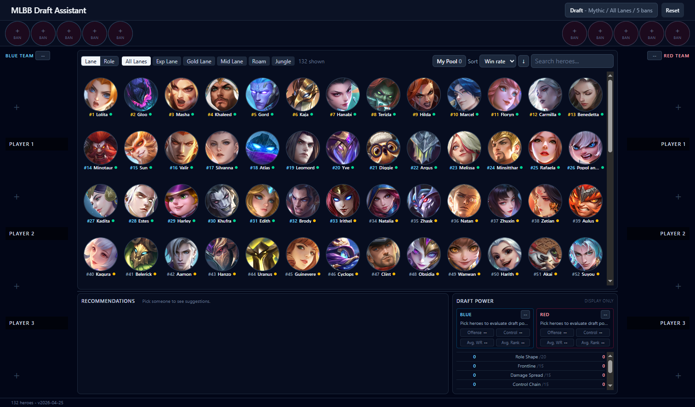
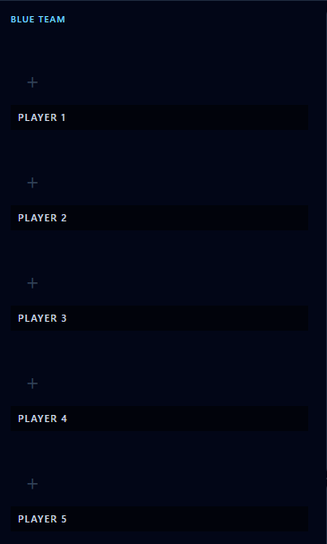
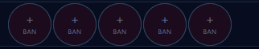
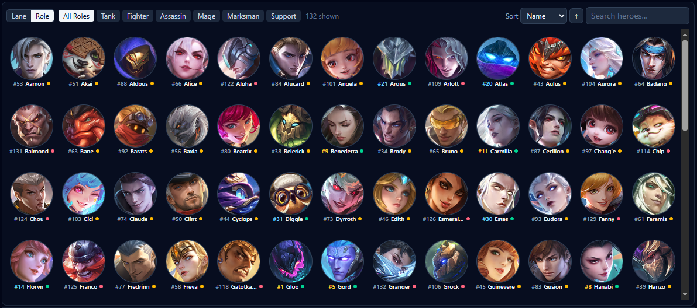
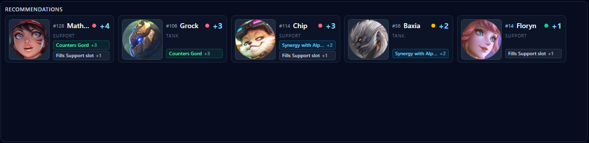
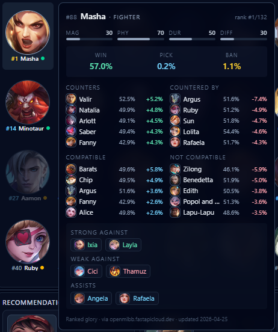
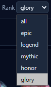
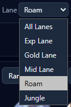
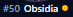

# MLBB Draft Assistant

A live, transparent draft helper for **Mobile Legends: Bang Bang**. Fill in
enemy picks, ally picks, and bans on a familiar draft-board layout and the app
instantly tells you which remaining heroes counter the enemy, synergize with
your team, and patch your composition — and **why**, in plain English.

Data is pulled live from the public [`openmlbb.fastapicloud.dev`](https://openmlbb.fastapicloud.dev/api/docs)
API (rank, win / pick / ban rates, counters, compatibility, relations) and
mixed with a one-shot local scrape of the full hero roster.

> **Screenshots:** Capture the UI yourself from <http://localhost:5173> and
> drop the PNGs into `docs/screenshots/` with the filenames referenced below.
> The README is wired up — once the files exist, the images render.

---

## Full app view



The main screen keeps both draft columns, the searchable hero pool, live
recommendations, and draft power visible in one workspace.

---

## Why use it

A draft in MLBB takes ~60 seconds. You don't have time to remember every
matchup across 130+ heroes. This app turns "I should probably ban Hayabusa"
into a ranked list with the data — counters with delta win-rates, synergies,
role gaps — already on screen, every time the board changes.

It's not a black box. Every recommendation comes with the reasons that
produced its score, so you can override the suggestion when you know better.

---

## Feature tour

### Draft board — blue team / red team columns

The familiar in-game layout: 5 picks per team, allies on the left, enemies
on the right. Click an empty slot to make it the active target, then click a
hero in the pool to fill it. Click a filled slot to clear it. **Esc** clears
selection.



**Why it helps:** the layout matches the in-game draft, so input is muscle
memory. Recommendations update on every change, so partial drafts already
guide your bans and your first pick.

---

### Ban bar with rank-aware ban count

Bans live in a top strip mirrored across both teams. The number of bans per
team auto-follows the rank tier — **3 in Epic, 4 in Legend, 5 in Mythic+** —
matching MLBB's actual rules. You can override it with the **Bans 3 / 4 / 5**
toggle in the header.



**Why it helps:** banning the wrong number of slots silently breaks the math
(too many or too few used heroes). Auto-following rank means the math is
always right; the override is there for custom modes.

---

### Hero pool with search, filters, and ownership

The center panel shows every hero not yet picked or banned. Type to search by
name. Click a role / lane chip to filter. Click an active filter again to
clear it. Toggle **Edit pool** to mark which heroes you own.



**Why it helps:** you can scan the live pool by class while drafting, and the
**Filter recs to my pool** toggle (header) restricts suggestions to heroes
you can actually lock in — no more "perfect counter, never played them"
recommendations.

---

### Live recommendations with reasons

Below the pool sits the top-5 recommendations panel. Each card shows the
hero, score, role, and the human-readable reasons:

- **+3 counters** an enemy pick
- **−3 countered by** an enemy pick
- **+2 synergy** with an ally pick
- **+1 fills role** missing from your team

Ties broken by lower difficulty (easier heroes surface first). The panel is
**resizable** by dragging the divider above it — make it bigger when you want
more candidates visible at once.



**Why it helps:** the reasons make every suggestion auditable. If the app
says "pick Hylos, +3 counters Miya, +2 synergy Lolita" you can verify that
matches your read of the lobby instead of trusting a black-box score.

---

### Hero stats popover (live data)

Hover any hero — in the pool, in a slot, in a ban, in the recommendations —
to open a popover with live data for the **selected rank tier**:

- Current rank position (`#23 / 132`) and win / pick / ban rates
- Top counters and "countered by" with win-rate deltas, side by side
- Compatible and not-compatible heroes (synergy data)
- Moonton-curated `strong / weak / assist` triples
- Magic / physical / durability / difficulty stat bars
- Data freshness timestamp from the upstream API

The popover is *sticky* — move the cursor into it to keep it open, click
through to navigate.



**Why it helps:** before you commit a pick, this is the one place that
answers "is this hero actually meta this patch?" without leaving the app.
The win-rate deltas turn matchup folklore ("Hayabusa wrecks marksmen") into
a number for the rank you actually play.

---

### Rank tier selector

Rank dropdown in the header (`all / epic / legend / mythic / honor / glory`).
Every live API call — leaderboard, counters, compatibility — re-runs against
the chosen tier so the data reflects players at your level.



**Why it helps:** Mythic-and-above counter math is wildly different from
Epic. A hero that's S-tier in Glory may be unplayable for an Epic lobby and
vice versa. Match the data to your reality.

---

### Lane filter

Lane dropdown in the header (`gold / exp / mid / jungle / roam / any`). Maps
to roles (Marksman, Fighter, Mage, Assassin, Tank+Support, no filter) and
restricts the recommendation panel to that subset.



**Why it helps:** if you're locked into Jungle, you don't need Tank
suggestions. The lane filter cuts the recommendation list to "heroes I'd
actually pick for my role."

---

### Per-tile rank and win-rate dot

Every hero tile (pool, picks, bans) gets a small **rank position** badge
(`#7`) and a colored **win-rate dot** next to the name, sourced from the
leaderboard for the active rank. Color goes red → amber → green as win-rate
climbs.



**Why it helps:** lets you eyeball the meta at a glance without opening the
popover for every hero. A column of green dots in your suggestions is
reassuring; a column of red ones means the algorithm liked the matchup but
the hero isn't currently performing.

---

## How a draft session typically goes

1. **Open the app.** Pick your **rank** (top-right) so all live data matches
   your bracket.
2. **Set your lane** so suggestions are filtered to your role.
3. **First ban phase.** As enemy bans come in, click them into the red ban
   row; bans against you go in blue. The recommendations already start
   shifting.
4. **First-pick / counter-pick.** Click the appropriate pick slot, scan the
   recommendations panel, and hover the candidates to confirm with live
   counters / win-rates before locking in.
5. **Subsequent picks.** Each pick refines the recommendations: missing
   roles bump matching heroes by +1, synergies bump partners by +2.

The whole loop — click slot, read 5 cards, hover one, lock — fits inside the
30-second pick timer.

---

## Stack

| Layer    | Tech                       | Notes                                        |
|----------|----------------------------|----------------------------------------------|
| Scraper  | Python 3.10+, `requests`   | One-shot ETL → `heroes.json` + portraits     |
| Backend  | FastAPI + uvicorn          | Local proxy + scoring + live-stats fan-out   |
| Frontend | React 19 + Vite + Tailwind | Pure view layer over the FastAPI backend     |
| Data     | `openmlbb.fastapicloud.dev`| Public MLBB data API — see [CLAUDE.md](CLAUDE.md#mlbb-api-reference-verified) |

No database, no auth, no secrets. Everything runs on `localhost`.

---

## Running it

See [RUNNING.md](RUNNING.md) for the full three-process recipe. Short version:

```powershell
# one-shot, populates scraper/output/
cd scraper && python scrape.py

# backend on :8000
cd ../server && python -m uvicorn main:app --reload --port 8000

# frontend on :5173
cd ../web && npm install && npm run dev
```

Then open <http://localhost:5173>.

---

## What's next (v2)

The frontend exposes a `window.mlbbDraft.setState({...})` seam (and a
`mlbb:setState` CustomEvent) so a future screen-capture module can push
detected picks/bans into the same reducer without touching the UI. The plan
is to use `getDisplayMedia()` against a LonelyScreen mirror of an iPhone and
template-match against the cached portraits with OpenCV.js. Ideas and
in-progress design notes live in [IDEAS.md](IDEAS.md).

---

## Project layout

```
mlbb-draft-assistant/
├── scraper/   # Python: one-shot harvest of the openmlbb API
├── server/    # FastAPI: proxy + recommendations + live stats
├── web/       # React + Vite + Tailwind frontend
├── docs/
│   └── screenshots/   # ← drop the README's PNGs here
├── CLAUDE.md  # architectural source of truth
├── RUNNING.md # local-dev recipe
└── IDEAS.md   # roadmap / in-progress design notes
```

---

## Contributing screenshots

When grabbing screenshots for the README:

- Run with a fully-loaded draft (all 5 ally + 5 enemy + bans filled) for
  pictures that show real data, **not** an empty board.
- Use **Mythic** rank for the live data shots so the popover and tile
  metadata have meaningful numbers.
- Crop tightly — full-window captures get hard to read at GitHub's render
  width.
- Save as PNG, ~1200px wide. Filenames must match the `docs/screenshots/`
  references above.
